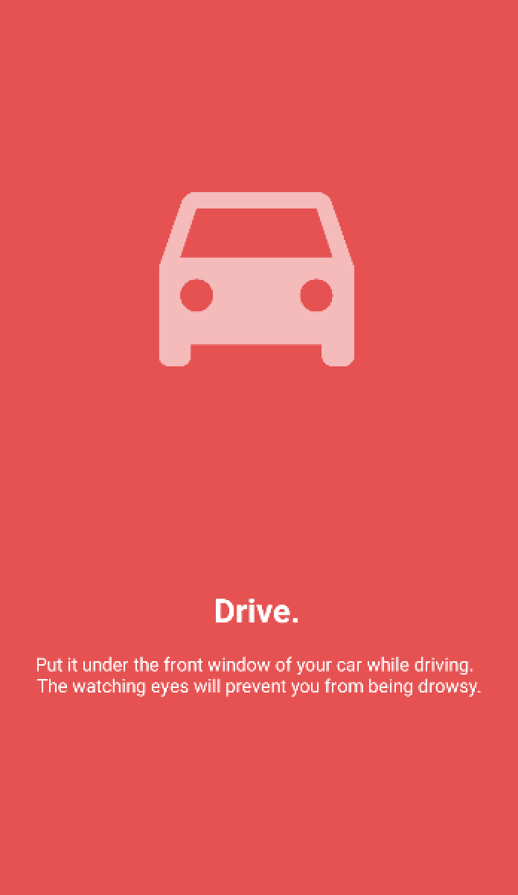

# Anti Drowsiness HUD

## Description

Use this app to prevent drowsiness.

Put the phone under the front window of car with the app open.
The watching eye effect will prevent the drivers from falling asleep.

You can also put the phone on the desk with the app open.
The eyes will shake every 25 minutes.
Use this app as a pomodoro timer to help you focus.

## App Overview

 

   
